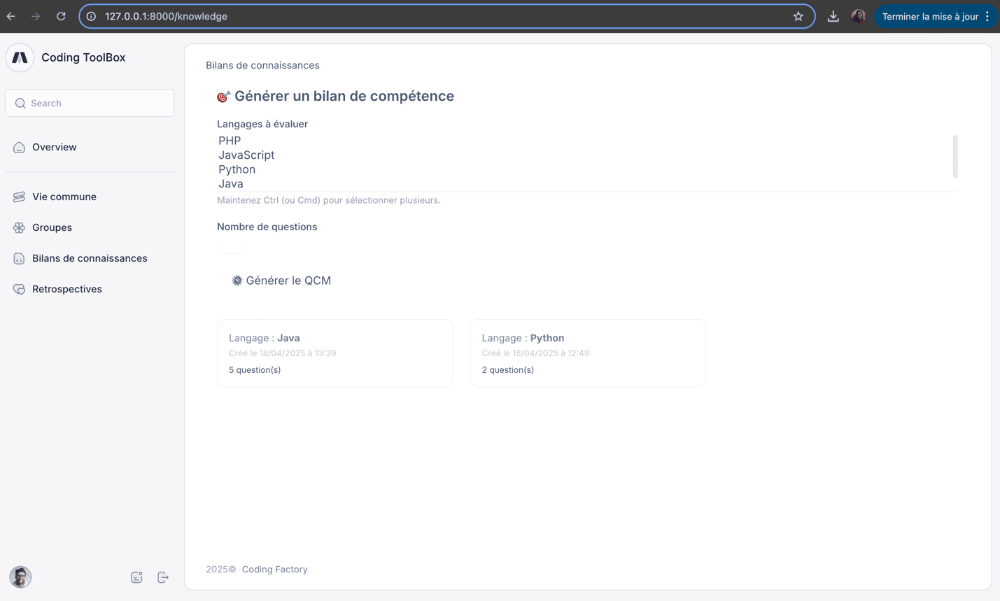
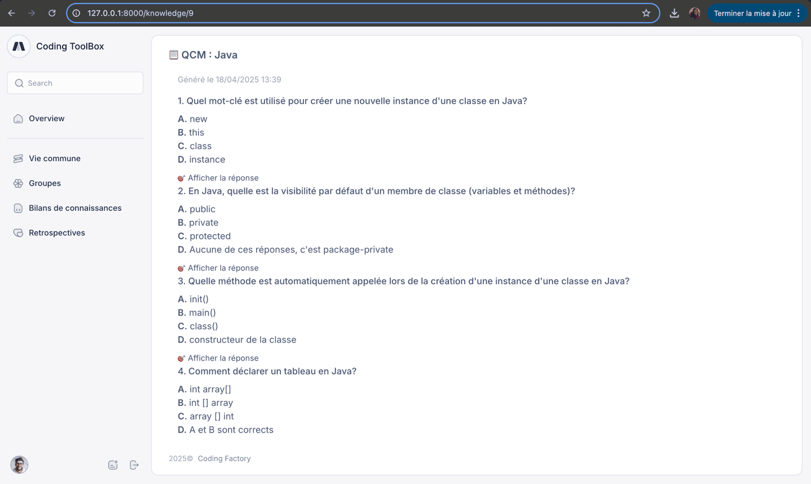

# 🚀 Coding Tool Box – Guide d'installation

Bienvenue dans **Coding Tool Box**, un outil complet de gestion pédagogique conçu pour la Coding Factory.  
Ce projet Laravel inclut la gestion des groupes, promotions, étudiants, rétro (Kanban), QCM  dynamiques, et bien plus.

---

## 📦 Prérequis

Assurez-vous d’avoir les éléments suivants installés sur votre machine :

- PHP ≥ 8.1
- Composer
- MySQL ou MariaDB
- Node.js + npm (pour les assets frontend si nécessaire)
- Laravel CLI (`composer global require laravel/installer`)

---

## ⚙️ Installation du projet

Exécutez les étapes ci-dessous pour lancer le projet en local :

### 1. Cloner le dépôt

```bash
git clone https://m_thibaud@bitbucket.org/m_thibaud/projet-web-2025.git
cd coding-tool-box
cp .env.example .env
```

### 2. Configuration de l'environnement

```bash
✍️ Ouvrez le fichier .env et configurez les paramètres liés à votre base de données :

DB_DATABASE=nom_de_votre_bdd
DB_USERNAME=utilisateur
DB_PASSWORD=motdepasse
```

### 3. Installation des dépendances PHP

```bash
composer install
```

### 4. Nettoyage et optimisation du cache

```bash
php artisan optimize:clear
```

### 5. Génération de la clé d'application

```bash
php artisan key:generate
```

### 6. Migration de la base de données

```bash
php artisan migrate
```

### 7. Population de la base (Données de test)

```bash
php artisan db:seed
```

---

## 💻 Compilation des assets (si nécessaire)

```bash
npm install
npm run dev
```

---

## 👤 Comptes de test disponibles

| Rôle       | Email                         | Mot de passe |
|------------|-------------------------------|--------------|
| **Admin**  | admin@codingfactory.com       | 123456       |
| Enseignant | teacher@codingfactory.com     | 123456       |
| Étudiant   | student@codingfactory.com     | 123456       |

---

## 🚧 Fonctionnalités principales

- 🔧 Gestion des groupes, promotions, étudiants
- 📅 Vie commune avec système de pointage
- 📊 Bilans semestriels étudiants via QCM générés par IA
- 🧠 Génération automatique de QCM par langage sélectionné
- ✅ Système de Kanban pour les rétrospectives
- 📈 Statistiques d’usage et suivi pédagogique 


# 🎓 Coding Toolbox - Bilan de Connaissances
## 📌 Contexte du backlog 2
Cette parti du projet s’inscrit dans le cadre d’un exercice d’évaluation permettant de générer
et visualiser des **bilans de compétences** sous forme de QCM, en lien avec différents langages
de programmation et créer des tâches par les administrateurs tout en permettant aux étudiants d'intéragir
avec et pouvoir commenter et valider les tâches.

---

## 🚀 Fonctionnalités développées

J’ai implémenté les fonctionnalités suivantes :

### ✅ User Stories réalisées :

- **Story 1** : En tant qu’administrateur, je peux générer un QCM en choisissant :
  - Un ou plusieurs langages de programmation
  - Le nombre de questions souhaitées

- **Story 2** : Les questions sont générées aléatoirement depuis une base de données contenant des questions pré-enregistrées.

- **Story 3** : En tant qu’utilisateur, je peux consulter la liste des QCM générés, chacun présenté dans une carte individuelle.

- **Story 4** : En cliquant sur un QCM, je peux :
  - Voir toutes les questions du QCM
  - Afficher les réponses **seulement** si je clique sur un bouton « Afficher la réponse »

---

## 🛠️ Choix techniques

- **Backend** : Laravel 12.x, PHP 8.4
- **Base de données** : MySQL (via Eloquent ORM)
- **Frontend** : Blade + TailwindCSS
- **JS** : Alpine.js pour les interactions simples (ex : bouton « Afficher la réponse »)
- **Authentification** : Laravel Breeze (auth classique)

---

## 📷 Aperçu

Voici un aperçu de l’interface :



### Page de génération :
  - Sélection des langages
  - Choix du nombre de questions
  - Bouton « Générer le QCM »

### Liste des QCM :
  - Chaque QCM est affiché dans un **card** cliquable

### Page de visualisation d’un QCM :
  - Liste des questions
  - Bouton pour révéler la bonne réponse

---

## ⚠️ Difficultés rencontrées

- **Manipulation de données JSON**
  - Problème : au début, j’essayais de `json_decode()` un tableau, ce qui provoquait une erreur (`json_decode(): Argument must be of type string`).
  - Solution : j’ai corrigé ça en vérifiant le format des données avant le décodage, ou en évitant `json_decode()` si les données étaient déjà au bon format.

- **Relations entre les modèles**
  - J’ai dû bien comprendre comment relier les `KnowledgeTest` à leurs `Questions`, et comment stocker les réponses multiples au bon format.

- **Affichage dynamique des réponses**
  - J’ai utilisé Alpine.js pour permettre à l’utilisateur de voir ou cacher la réponse d’une question, sans recharger la page.

- **Temps de mise en place du front**
  - Tailwind est puissant, mais il a fallu un peu de temps pour construire une interface un peu moche j'avoue mais au moins c claire et propre.

---

## ✅ Idées d'améliorations

- Ajout d’un système de réponse interactif (avec notation)
- Export PDF d’un QCM
- Pouvoir modifier ou supprimer un QCM
- Filtrer les QCM par langage
- Dashboard d’administration plus complet

---
## Contributor

|  |
|:--------------------------------------------------------------------------:|
|               [siwar142001](https://github.com/siwar142001)                |